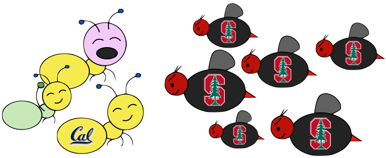
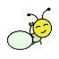
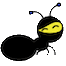
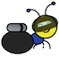

 # Ants

## Project : Ants Vs. SomeBees

> 
> 
> The bees are coming\!  
> Create a better soldier  
> With inherit-ants.

### Introduction

In this project, you will create a [tower defense](https://secure.wikimedia.org/wikipedia/en/wiki/Tower_defense) game called Ants Vs. SomeBees. As the ant queen, you populate your colony with the bravest ants you can muster. Your ants must protect their queen from the evil bees that invade your territory. Irritate the bees enough by throwing leaves at them, and they will be vanquished. Fail to pester the airborne intruders adequately, and your queen will succumb to the bees' wrath. This game is inspired by PopCap Games' [Plants Vs. Zombies](http://www.popcap.com/games/pvz/web) ®.

This project combines functional and object-oriented programming paradigms, focusing on the material from Chapter 2.5 of the lecture notes. The project also involves understanding, extending, and testing a large program with many related parts.

This project includes several files, but all of your changes will be made to the first two. You can download all of the project code as a [zip archive](ants.zip).

<table cellpadding="10"><tbody><tr><td><code><a href="ants.py">ants.py</a></code></td><td>The game logic of Ants Vs. SomeBees.</td></tr><tr><td><code><a href="written.txt">written.txt</a></code></td><td>A place to answer the written problems in the project.</td></tr><tr><td><code><a href="tests.py">tests.py</a></code></td><td>A series of <i>unit tests</i> to test various parts of your project.</td></tr><tr><td><code><a href="ants_gui.py">ants_gui.py</a></code></td><td>Graphics for Ants Vs. SomeBees.</td></tr><tr><td><code><a href="graphics.py">graphics.py</a></code></td><td>General functions for displaying simple two-dimensional animations.</td></tr><tr><td><code><a href="ucb.py">ucb.py</a></code></td><td>Utility functions for 61A.</td></tr></tbody></table>

### Logistics

This is a two-week project. You'll work in a team of two people, person A and person B. In each part, you will do some of the work separately and some together with your partner. For example, if a problem is marked A1, then it is a solo problem for person A. Both partners should read, think about, and understand the solution to all questions.

Start early\! The amount of time it takes to complete a project \(or any program\) is unpredictable. Ask for help early and often \-- the TAs and lab assistants are here to help.

In the end, you and your partner will submit one project. Person-specific problems are graded individually and do not affect your partner's score. There are 25 possible points for each person. If you choose to work alone, you must complete the entire project, including all of the questions posed to both partners.

The only two files that you are required to submit are `[ants.py](ants.py.html)` and `<written.txt>`. You do not need to modify any other files in order to complete the project. To submit the project, change to the directory where the files are located and run `submit proj3`.

**This project is due by noon on Wednesday, October 19.**

### Core Concepts

A game of Ants Vs. SomeBees consists of a series of turns. In each turn, new bees may enter the ant colony. Then, new ants are placed. Finally, all insects \(ants, then bees\) take individual actions: bees sting ants, and ants throw leaves at bees. The game ends either when a bee reaches the ant queen \(you lose\), or the entire bee flotilla has been vanquished \(you win\).

**The Colony**. The colony consists of several places that are chained together. The `exit` of each `Place` leads to another `Place`.

**Placing Ants**. There are two constraints that limit ant production. Placing an ant uses up some amount of the colony's food, a different amount for each type of ant. Also, only one ant can occupy each `Place`.

**Bees**. When it is time to act, a bee either moves to the `exit` of its current `Place` if no ant blocks its path, or stings an ant that blocks its path.

**Ants**. Each type of ant takes a different action and requires a different amount of food to place. The two most basic ant types are the `HarvesterAnt`, which adds one food to the colony during each turn, and the `ThrowerAnt`, which throws a leaf at a bee each turn.

### The Code

Most concepts in the game have a corresponding class that encapsulates the logic for that concept. For instance, a `Place` in the colony holds insects and connects to other places. A `Bee` stings ants and advances through exits.

The game can be run in two modes: as a text-based game or using a graphical user interface \(GUI\). The game logic is the same in either case, but the GUI enforces a turn time limit that makes playing the game more exciting. The text-based interface is provided for debugging and development.

The files are separated according to these two modes. `[ants.py](ants.py.html)` knows nothing of graphics or turn time limits. All graphical elements are specified in `[ants_gui.py](ants_gui.py.html)` and `[graphics.py](graphics.py.html)`. It is possible to complete this project without ever reading the graphics files.

To start a text-based game, run

python3 ants.py

To start a graphical game, run

python3 ants\_gui.py

When you start the graphical version, a new window should appear:

In the starter implementation, you have unlimited food and your ants only throw leaves at bees in their current `Place`. Try playing a game anyway\! You'll need to place a lot of `ThrowerAnt`s \(the second type\) in order to keep the bees from reaching your queen.

You have also been provided a testing file `[tests.py](tests.py.html)` that runs a series of unit tests for the project. To test your project, you can run

python3 tests.py -v

This command runs all of the unit tests along with any doctests in ants.py. The optional `-v` generates more verbose output. If you would like to learn more about Python's built-in unit testing framework, read the documentation on the [unittest module](http://docs.python.org/py3k/library/unittest.html). Most problems have associated tests. Make sure that the tests for each problem pass before moving on.

### Phase 1

#### Both Partners

**Problem 1** \(3 pts\). Answer the following written questions in the file called `written.txt` after you have read the _entire_ `[ants.py](ants.py.html)` file.

1.  Which method in which class runs a game\? \(the answer is not `run`, because `run` is not a method\)\!
2.  The `Hive`, a subclass of `Place`, is the starting location of the bees. Unlike most instances of `Place`, the `Hive` class does not have an `exit`. Explain how and when `Bee`s leave the `Hive`.
3.  Explain the mechanism in the code by which the places in the colony are laid out. How do you modify the code to produce more places\?
4.  What is the significance of an `Insect`s `armor` attribute\? What happens when `armor` reaches 0\?

**Problem 2** \(2 pts\). Add food costs and implement harvesters. Currently, there is no cost for deploying any type of `Ant`, and so there is no challenge to the game. You'll notice that `Ant` starts out with a base `food_cost` of 0. Override this value in each of the subclasses listed below with the correct costs.

<table class="ant"><tbody><tr><td><b>Class</b></td><td><b>Food</b></td><td><b>Armor</b></td></tr><tr><td> <code>HarvesterAnt</code></td><td>2</td><td>1</td></tr><tr><td> <code>ThrowerAnt</code></td><td>4</td><td>1</td></tr></tbody></table>

Now there's no way to gather more food\! To fix this issue, implement the `HarvesterAnt` class. A `HarvesterAnt` is a type of `Ant` that adds one food to the `colony.food` total as its `action`.

Try playing the game again. Once you have placed a `HarvesterAnt`, you should accumulate food each turn. Vanquishing the bees using the default game setup is now possible, but should be challenging.

**Problem 3** \(2 pts\). Add code to the `Place` constructor that tracks entrances. Right now, a `Place` keeps track only of its `exit`. We would like a `Place` to keep track of its entrance as well. A `Place` needs to track only one `entrance`.

However, simply passing an entrance to a `Place` constructor will be problematic; we will need to have both the exit and the entrance before we can create a `Place`\! \(It's a [chicken or the egg](https://secure.wikimedia.org/wikipedia/en/wiki/Chicken_or_the_egg) problem.\) To get around this problem, we will keep track of entrances in the following way instead. The `Place` constructor should specify that:

* A newly created `Place` always starts with its `entrance` as `None`.
* If the `Place` has an `exit`, then the `exit`'s `entrance` is set to that `Place`.

#### Person A

**Problem A4** \(2 pts\). Add water to the colony. Currently there are only two types of places, the `Hive` and a basic `Place`. To make things more interesting, we're going to create a new type of `Place` called `Water`.

Only an ant that is `watersafe` can be deployed to a `Water` place. In order to determine whether an `Insect` is `watersafe`, add a new attribute to the `Insect` class named `watersafe` that is `False` by default. Since bees can fly, make their `watersafe` attribute `True`, overriding the default.

Now, implement the `add_insect` method for `Water` that, in addition to doing the same thing as a `Place` would do, immediately kills the added insect if it is not `watersafe` by modifying the `Insect`s `armor`. **Do not** copy and paste code. Make use of inheritance to reuse the functionality of the `Place` class.

Once you've finished this problem, play a game that includes water. To access the `mixed_layout` that includes water, add the `--water` option \(or `-w` for short\) when you start the game.

python3 ants\_gui.py --water

**Problem A5** \(3 pts\). Implement the `FireAnt`. A `FireAnt` has a special `reduce_armor` method that, when the `FireAnt`'s armor reaches zero or lower, will reduce the armor of _all_ `Bee`s in the same `Place` as the `FireAnt` by `3` \(a fiery end indeed\).

<table class="ant"><tbody><tr><td><b>Class</b></td><td><b>Food</b></td><td><b>Armor</b></td></tr><tr><td> <code>FireAnt</code></td><td>4</td><td>1</td></tr></tbody></table>

_Hint:_ If you iterate over a list, but change the contents of that list at the same time, you may not see all the elements. As the [Python tutorial](http://docs.python.org/py3k/tutorial/controlflow.html#for-statements) suggests, "If you need to modify the list you are iterating over, you must iterate over a copy." Remember that damaging a bee may cause it to be removed from its place.

Once you've finished implementing the `FireAnt`, give it an instance attribute `implemented` with the value `True`. This attribute tells the game that you've added a new type of `Ant`.

After implementing `FireAnt`, be sure to test your program by playing a game or two\! A `FireAnt` should destroy any co-located Bees when it dies.

#### Person B

**Problem B4** \(2 pts\). Implement the `nearest_bee` method for the `ThrowerAnt` class. In order for a `ThrowerAnt` to attack, it must know which bee it should hit. The provided implementation will only hit bees in the same `Place`. Your job is to fix it so that a `ThrowerAnt` will `throw_at` the nearest bee in front of it that is not still in the `Hive`.

The `nearest_bee` method returns a random `Bee` from the nearest place that contains bees. Places are inspected in order by following their `entrance` attributes.

* Start from the current `Place` of the `ThrowerAnt`.
* For each place, return a random bee if there is any, or consider the next place that is stored as the current place's `entrance`.

After implementing `nearest_bee`, a `ThrowerAnt` should be able to `throw_at` a `Bee` in front of it that is not still in the `Hive`. Make sure that your ants do the right thing\!

**Problem B5** \(3 pts\). Now that the `ThrowerAnt` has been completed, implement two subclasses of `ThrowerAnt`.

* The `LongThrower` can only `throw_at` a `Bee` that is found after following at least 4 `entrance` transitions. So the `LongThrower` can't hit `Bee`s that are in the same `Place` as it or the first 3 `Place`s in front of it.
* The `ShortThrower` can only `throw_at` a `Bee` that is found after following at most 2 `entrance` transitions. So the `ShortThrower` can only hit `Bee`s in the same `Place` as it and 2 `Place`s in front of it.

Neither of these specialized throwers can `throw_at` a `Bee` that is exactly 3 `Place`s away. Placing a single one of these \(and no other ants\) should never win a default game.

<table class="ant"><tbody><tr><td><b>Class</b></td><td><b>Food</b></td><td><b>Armor</b></td></tr><tr><td> <code>ShortThrower</code></td><td>3</td><td>1</td></tr><tr><td> <code>LongThrower</code></td><td>3</td><td>1</td></tr></tbody></table>

To implement these behaviors, modify the `nearest_bee` method to reference `min_range` and `max_range` attributes, and only return a bee that is in range.

For the base class, `ThrowerAnt`, set `min_range` to 0 and `max_range` to 10. Then, implement the subclasses `LongThrower` and `ShortThrower` with appropriately constrained ranges and correct food costs.

Set the `implemented` class attribute of `LongThrower` and `ShortThrower` to `True`.

Try playing a game with your newly implemented ants. Be sure that they do what you expect them to\! You can try running `[ants_gui.py](ants_gui.py.html)` with the `--full` option to go up against a full swarm of bees in a multi-tunnel layout, and add `--insane` if you want a real challenge\! If the bees are too numerous to vanquish, you might need to create some new ants in Phase 2.

### Phase 2

#### Person A

**Problem A6** \(1 pts\). We are going to add some protection to our glorious `AntColony` by implementing the `WallAnt`, which is an ant that does nothing each turn \(already the default `action` of the `Ant` class\). A `WallAnt` is useful because it has a large `armor` value.

<table class="ant"><tbody><tr><td><b>Class</b></td><td><b>Food</b></td><td><b>Armor</b></td></tr><tr><td> <code>WallAnt</code></td><td>4</td><td>4</td></tr></tbody></table>

**Problem A7** \(3 pts\). Implement the `NinjaAnt`, which damages all `Bee`s that pass by, but is never seen.

<table class="ant"><tbody><tr><td><b>Class</b></td><td><b>Food</b></td><td><b>Armor</b></td></tr><tr><td> <code>NinjaAnt</code></td><td>6</td><td>1</td></tr></tbody></table>

A `NinjaAnt` is not able to be attacked by a `Bee` because it is hidden, nor does it block the path of a `Bee` that flies by. To implement this behavior, first modify the `Ant` class to include a new class attribute `blocks_path` that is `True` by default. Set the value of `blocks_path` to `False` in the `NinjaAnt` class.

Second, modify the `Bee`'s method `blocked` to return `False` if either there is no `Ant` in the `Bee`'s `place` or if there is an `Ant`, but its `blocks_path` attribute is `False`. Now `Bee`s will just fly past `NinjaAnt`s.

Finally, we want to make the `NinjaAnt` damage all `Bee`'s that fly past. Implement the `action` method in `NinjaAnt` to reduce the armor of all `Bee`s in the same `place` as the `NinjaAnt` by 1, overriding the default action method inherited from `Ant`.

For a challenge, try to win a default game using only `HarversterAnt` and `NinjaAnt`.

#### Person B

**Problem B6** \(1 pts\). Currently there are no ants that can be placed on `Water`. Implement the `ScubaThrower`, which is a subclass of `ThrowerAnt` that is more costly and `watersafe`, but otherwise identical to its base class.

<table class="ant"><tbody><tr><td><b>Class</b></td><td><b>Food</b></td><td><b>Armor</b></td></tr><tr><td> <code>ScubaThrower</code></td><td>5</td><td>1</td></tr></tbody></table>

Placing a `ScubaAnt` in `Water` should not cause it to die.

**Problem B7** \(3 pts\). We will now implement the new offensive unit called the `HungryAnt`, which will eat a random `Bee` from its `place`, instantly killing the `Bee`. After eating a `Bee`, it must spend 3 turns digesting before eating again.

<table class="ant"><tbody><tr><td><b>Class</b></td><td><b>Food</b></td><td><b>Armor</b></td></tr><tr><td> <code>HungryAnt</code></td><td>4</td><td>1</td></tr></tbody></table>

To implement, give `HungryAnt` a `time_to_digest` class attribute that holds the number of turns that it takes all `HungryAnt`s to digest \(default to 3\). Also, give each `HungryAnt` an instance attribute `digesting` that counts the number of turns it has left to digest \(default is 0, since it hasn't eaten anything at the beginning\).

Now we implement the `action` method of the `HungryAnt` to check if it's digesting; if so, decrement its `digesting` counter. Otherwise, eat a random `Bee` in its `place` \(killing the `Bee` and restarting the `digesting` timer\).

#### Both Partners

**Problem 8** \(5 pts\). Implement the `BushAnt`. Right now, our ants are quite frail. We'd like to provide a way to help them last longer against the onslaught of the bees. Enter the `BushAnt`.

<table class="ant"><tbody><tr><td><b>Class</b></td><td><b>Food</b></td><td><b>Armor</b></td></tr><tr><td> <code>BushAnt</code></td><td>4</td><td>2</td></tr></tbody></table>

A `BushAnt` differs from a normal `Ant` because it can occupy the same `Place` as another ant. When a `BushAnt` is added to the same `Place` as another ant, it shields the other ant and protects it from damage. Attacks should damage the `BushAnt` first and only hurt the protected ant after the `BushAnt` has perished.

A `BushAnt` has an instance attribute `ant` that stores the ant contained within the bush. It should start off as `None`, indicating that no ant is currently being protected. Give `BushAnt` a `contain_ant` method that takes an `Ant` argument and sets the `ant` instance attribute to that argument.

Now, change your program so that a `BushAnt` and another `Ant` can simultaneously occupy the same `Place`:

1.  Add an `Ant.container` class attribute that indicates whether an ant can contain another. For all `Ant`s except `BushAnt`, `container` should be `False`. The `BushAnt.container` attribute should be `True`.
2.  We also need to give `Ant`s a new method, `can_contain`, that takes an `other` ant as an argument and returns `True` if and only if:
    1.  This ant is a container.
    2.  This ant does not already contain another ant.
    3.  The other ant is not a container.
3.  Right now, if we attempt to put a second ant in a `Place`, the `add_insect` method of the `Place` class will immediately cause an error. Change `add_insect` so that the `Place` contains the container ant and the container ant contains the other ant:
    * If the `Ant` currently occupying this `Place` can contain the `Ant` we are trying to add, then simply tell it to do so.
    * If the `Ant` we are trying to add can contain the `Ant` currently occupying this `Place`, then have it do so _and_ set this `Place`'s ant to be the newly added `Ant`.
    * If neither `Ant` can contain the other, then raise the same assertion error as before.

Almost done\! Just a few more things to do. When a `BushAnt` perishes, we need to make sure the ant it currently contains \(if it contains one\) takes the `BushAnt`'s place. Override the `reduce_armor` method so that, if the `BushAnt` perishes, it will set its place's ant to be the ant it currently contains. \(Remember to use inheritance\!\)

The last step is to make sure that ants that are contained by `BushAnt`s still perform their action. Override the `action` method for `BushAnt` accordingly.

**Problem 9** \(4 pts\). Implement two final thrower ants that do no damage, but instead replace the `action` method of a `Bee` instance that they `throw_at` with a new method that alters the `Bee`'s behavior for some duration. You will do this by writing the `apply_effect` function, which takes a `Bee` instance and changes its action method.

A slow action will only invoke the `Bee`'s original action on even-numbered turns \(`colony.time % 2 == 0`\). A stun action will cause the `Bee` to do nothing. Both of these affected methods can be created by higher-order functions that take and return an action method. You will find `def` statements for `make_slow` and `make_stun` in the `Status Effect` section of `[ants.py](ants.py.html)`

Implement two new ants that subclass `ThrowerAnt`. You only need to set their class attributes appropriately.

* `SlowThrower` applies a slow effect for 3 turns.
* `StunThrower` applies a stun effect for 1 turn.

<table class="ant"><tbody><tr><td><b>Class</b></td><td><b>Food</b></td><td><b>Armor</b></td></tr><tr><td> <code>SlowThrower</code></td><td>4</td><td>1</td></tr><tr><td> <code>StunThrower</code></td><td>6</td><td>1</td></tr></tbody></table>

**You are now done with the project\!**. If you weren't able to vanquish the bees' insane-mode assault plan before, do your new ants help\? Add some water or design your own layout to keep things interesting.

Feel free to design additional ants, layouts, and assault plans and post them to Piazza.

**Acknowledgements:** Tom Magrino and Eric Tzeng developed this project with John DeNero. Jessica Wan contributed the artwork.
